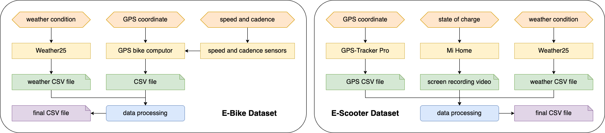

# DualEMobilityData-datasets
Welcome to our repository focused on E-Bike and E-Scooter trips. We aim to offer open-source datasets for E-Mobility research, particularly in urban commuting using electric bikes and scooters. These datasets, collected around Dublin City University, consider key factors influencing energy consumption.

# Dataset Description
Our datasets are divided into two parts: E-Bike and E-Scooter trips, totaling 36 and 30 trips, respectively. The E-Bike data were collected using the [Electric Trekking Bike T1](https://eleglide.com/products/removable-battery-100km-range-electric-trekking-touring-bike-t1) of Eleglide E-bike, and the E-Scooter data from the [Mi Electric Scooter Pro 2](https://www.xiaomi.ie/mi-electric-scooter-pro-2/) of Xiaomi E-Scooter. The process of data collection is presented in the picture below.

## E-Bike Dataset
The E-Bike featured in our dataset includes a 250 W motor with a top speed of 25 km/h, a range of 100 km, and a 450 Wh battery. It is equipped with a power assist module offering five levels of assist/electric mode corresponding to different speeds. Our dataset captures various real-world scenarios by including trip attributes for different pedal assist levels.

### Data Collection Setup
We employed the [iGS630 of iGPSPORT GPS Bike Computer](https://www.igpsport.com/igs630-highlights) and [LivLov V2 Bike Cadence and Speed Sensors](https://www.amazon.co.uk/LIVLOV-V2-Cadence-Speed-Sensor/dp/B08XNHDN6F?ref_=ast_sto_dp) for data collection. Attributes such as timestamps, GPS coordinates, altitude, speed, assistance level, and distance were recorded.

### Data Processing

- **Data Integration**: Merging data from devices for a unified dataset.
- **SOC Calculation**: Using a custom nonlinear equation for accurate SOC estimation.
- **Energy Efficiency Calculations**: Measuring energy consumption and efficiency.
- **Weather Data Incorporation**: Adding weather data from [Weather25](https://www.weather25.com/europe/ireland/leinster/dublin).
- **Synthetic Data Generation**: Creating a synthetic dataset with Python's Synthetic Data Vault library.

## E-Scooter Dataset
Our E-Scooter dataset features the Mi Electric Scooter Pro 2, equipped with a 600-watt motor and a high-capacity 446 Wh lithium battery. The scooter offers three speed modes, and our data collection focused on the sports mode (0-25 km/h).

### Data Collection Setup
Two mobile applications were employed to gather attributes of E-Scooter trips, encompassing timestamp, GPS coordinates, altitude, speed, and SOC. The SOC was extracted from screen recordings using Xiaomi’s official mobile application, [Mi Home](https://play.google.com/store/apps/details?id=com.xiaomi.smarthome&hl=en_US&pli=1), on an Android device (SAMSUNG Galaxy A53), while other attributes were directly acquired via a GPS tracking mobile application, [GPS-Tracker Pro](https://apps.apple.com/us/app/gps-tracker-pro/id984920064), on an Apple device (iPhone 11).

### Data Processing

- **Digit Extraction**: Using [pytesseract](https://pypi.org/project/pytesseract/) for SOC extraction.
- **Data Integration**: Integrating data from mobile applications using timestamps.
- **Weather Data Incorporation & Data Generation**: Employing methods similar to the E-Bike dataset.

## Sample Data Visualisation
A sample E-Scooter trip (Trip 27) is analysed and visualised in the pictures below.

This repository is open for academic and research purposes. We encourage contributions and feedback to enhance the datasets' quality and applicability. 

# Data Regulation & Ethics Statement

This research involving human participants was reviewed and approved by the Data Protection Office and Research Ethics Committee, Dublin City University with reference number _DCUREC/2023/025_. Written informed consent for participation was acquired for this study in accordance with the national legislation and the institutional requirements.
    
# Acknowledgement

This research was conducted with the financial support of Science Foundation Ireland _21/FFP-P/10266_ and _12/RC/2289\_P2_ at Insight the SFI Research Centre for Data Analytics at Dublin City University. For the purpose of Open Access, the author has applied a CC BY public copyright licence to any Author Accepted Manuscript version arising from this submission.

# License
This project is licensed under the MIT License - see the LICENSE file for details.
